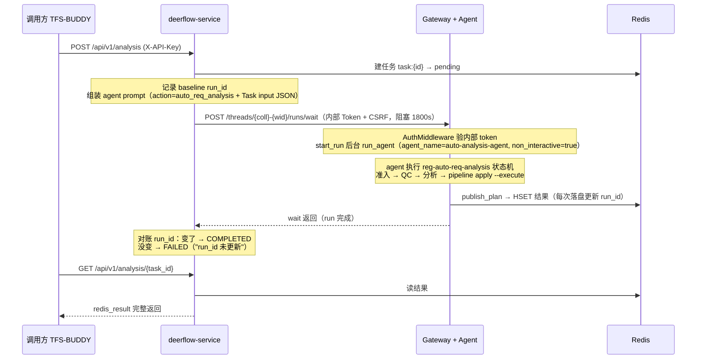

# deerflow-service 与 DeerFlow Agent 交互逻辑

> 生成时间：2026-08-14 | 适用范围：172.16.0.192:2026 部署（deerflow-service v2.0.0）

## 一句话定性

**deerflow-service 不是 agent，它是个"调度员"**——收任务、往 Gateway 塞任务、轮询时从 Redis 读结果。真正的分析是 Gateway 里的 `auto-analysis-agent`（即 `reg-auto-req-analysis` skill）干的，结果不走 HTTP 回传，而是**写 Redis**，靠一个 `run_id` 对账来判定成败。

## 架构速览

```
调用方 (TFS-BUDDY)
    │  POST /api/v1/analysis          (X-API-Key 认证)
    │  GET  /api/v1/analysis/{task_id} (轮询结果)
    ▼
deerflow-service  (FastAPI, 8003)
    │  ├─ 建任务 task:{id} → Redis（pending）
    │  ├─ 后台线程组装 prompt + 记录 baseline run_id
    │  └─ POST /api/threads/{coll}-{wid}/runs/wait   ← 阻塞等待
    │        (X-DeerFlow-Internal-Token + Owner-User-Id + CSRF cookie)
    ▼
DeerFlow Gateway  (FastAPI, 8001)
    │  ├─ AuthMiddleware 验内部 token → 合成 internal 用户
    │  ├─ start_run → 后台 run_agent（agent_name 路由）
    │  └─ wait_for_run_completion 等 END_SENTINEL 后返回
    ▼
auto-analysis-agent (lead_agent + agents/auto-analysis-agent/config.yaml)
    │  加载 reg-auto-req-analysis skill → 状态机执行
    │  pipeline.py apply --execute 回写 TFS
    ▼
Redis (26380)
    │  HSET auto-req:qc:plan:{collection}:{work_item_id}  ← 结果落盘（含 run_id）
    ▲
    └── deerflow-service 对账 run_id 变化 → COMPLETED / FAILED
```

## 角色分工

| 角色 | 是什么 | 干什么 |
|---|---|---|
| 调用方 | TFS-BUDDY | POST 提交需求分析、GET 轮询结果 |
| deerflow-service | FastAPI (8003) | 建任务、组装 prompt、调 Gateway、对账 |
| Gateway | DeerFlow 门面 (8001) | 认证、管理 run 生命周期、跑 LangGraph agent |
| auto-analysis-agent | lead_agent + agent_name 路由 | 执行 QC/分析状态机，结果写 Redis |
| Redis | 共享存储 | 任务状态 `task:{id}` + 分析结果 `auto-req:qc:plan:{coll}:{wid}` |

## 完整时序（10 步）



1. 调用方 `POST /api/v1/analysis`，带 `X-API-Key`（deerflow-service 自己的认证，`middleware/auth.py`）。
2. deerflow-service 建任务 `task:{uuid}` → `pending`，FastAPI `BackgroundTasks` 起后台线程跑 `_run_analysis_task`（`routers/analysis.py:64`）。
3. 后台线程先读 Redis 里 plan key 当前的 `run_id` 记为 **baseline**，再组装 prompt——把 `action=auto_req_analysis` + TFS 参数 + redis_key 打包成一段 "System automation task" 消息，并**明令禁止 agent 反问**。
4. 调 Gateway：`POST /api/threads/{collection}-{work_item_id}/runs/wait`，阻塞等待，超时放宽到 **1800s**（`services/deerflow_client.py:48`）。
5. Gateway `AuthMiddleware` 校验 `X-DeerFlow-Internal-Token` → 合成 internal 用户（`system_role=internal`），`start_run` 创建 RunRecord 并 `asyncio.create_task` 后台跑 `run_agent`（`backend/app/gateway/services.py:608`）。
6. agent 按 `agent_name=auto-analysis-agent` 路由加载，跑 `reg-auto-req-analysis` 状态机：准入 → QC（NEED-INFO/NEED-REVIEW/PASS）→ 分析（AUTO-ANA/MANUAL-REVIEW）→ `pipeline.py apply --execute` 回写 TFS。
7. 收尾时 `publish_plan` 用**纯标准库 socket + RESP2**（skill 侧零第三方依赖）HSET 结果到 Redis，**每次落盘更新 `run_id` 字段**（`skills/public/reg-auto-req-analysis/_lib/tfs/redis_client.py:462`）。
8. `wait` 订阅到 `END_SENTINEL` 返回（`services.py:873` wait_for_run_completion），agent 的最终响应文本作为返回值。
9. deerflow-service 重新读 Redis 的 `run_id` 和 baseline 比对：**变了 → COMPLETED；没变 → FAILED**（`routers/analysis.py:140`）。
10. 调用方 `GET /api/v1/analysis/{task_id}` 轮询，`completed` 时从 Redis 读出完整结果塞进 `redis_result` 返回。

## 七个关键机制

### 1. Thread = TFS 工作项

`thread_id = "{collection}-{work_item_id}"`（`deerflow_client.py:44`），一个需求一条对话历史，首次自动建、后续复用。这就是为什么 `human_feedback` / `additional_info` 重提时能"基于上轮结果修正、不重跑全流程"——agent 在上面的对话历史里。

### 2. 认证分两跳

- deerflow-service 自己的 API：`X-API-Key`（默认 `tfs-buddy-secret-key`）。
- 调 Gateway：`X-DeerFlow-Internal-Token`（server-to-server 内部通道）+ `X-DeerFlow-Owner-User-Id=auto-req-service`（归因：agent 的沙箱、记忆、文件都算在 auto-req-service 这个用户头上）+ CSRF double-submit cookie 对（`deerflow_client.py:36`）。

### 3. 为什么是 `runs/wait` 不是 `runs`

本部署的 Gateway 版本 `POST /runs`（非阻塞建后台 run）返回 **501**，只有 `/runs/wait` 可用（`deerflow_client.py:6` 注释写死）。所以是"HTTP 长连接阻塞等 agent 跑完"——早期那套 `run_poller`/`run_registry` 轮询方案就是这个原因被废弃的。待 Gateway 升级后可切回非阻塞 + 轮询。

### 4. `non_interactive` 只在内部通道生效

prompt 的 context 里带 `non_interactive=true`，Gateway 只在验证过内部 token 时才保留这个 key（`services.py:211`），效果是把 `ask_clarification` 工具从 agent 的工具集里摘掉——后台任务没人能回答反问。

### 5. agent 选择靠 context 路由，不是 assistant_id

请求里 `assistant_id` 恒为 `lead_agent`，真正的选择在 `make_lead_agent` 读 `config["agent_name"]`（`services.py:380`）。`agent_name=auto-analysis-agent` 通过 context 传入 → 加载 `agents/auto-analysis-agent/config.yaml`：

```yaml
name: auto-analysis-agent
description: TFS需求分析专家，可根据需求号进行需求合理性评估、需求分析两阶段工作，支持将分析结果回写TFS。
skills:
  - reg-auto-req-analysis
tool_groups:
  - bash
recursion_limit: 500
```

### 6. 结果不走 HTTP，走 Redis + run_id 对账

这是 8-13 假成功事故后的防呆设计：`/runs/wait` 返回的响应体不可信（可能是"瞬间完成"返回的旧 checkpoint），所以 deerflow-service 只认 **Redis plan key 的 `run_id` 是否变化**。`_run_analysis_task` 的异常分支也做了对账——wait 超时了但只要 run_id 变了照样判成功（`analysis.py:153`），避免"写成了但 HTTP 断了"被误报。

```python
# routers/analysis.py 关键逻辑
baseline_run_id = _plan_run_id(redis_key)  # 提交前落盘标记
...
deerflow_client.run_agent(...)             # 阻塞 wait
if _plan_run_id(redis_key) != baseline_run_id:
    → COMPLETED  # agent 真写了新结果
else:
    → FAILED     # "Agent run 结束但未写入新结果"
```

**已知坑**：agent 重跑时若复用历史 `run_id`（如 263409 的 `run_20260813_094217_263409` 多轮不变），对账只比对单一信号 → baseline 与跑完值相同 → 必判失败（TFS/Redis 实际都写成功了，属**假失败**）。修复方向：对账改双信号（run_id + execution_status 或 updated_at），或 skill 侧硬约束"重跑必须生成新 run_id"。

### 7. 并发保护

`multitask_strategy=reject`——同一 thread（即同一工作项）同时有两个 run 会直接 409（`backend/app/gateway/routers/thread_runs.py`），天然防止重复分析撞车。

## 重提/二轮修正（human_feedback）

同一工作项再次提交时（`human_feedback` 或 `additional_info` 非空），`_run_analysis_task` 组装的是"重提交" prompt：

- 明确告诉 agent 基于对话历史中的上轮分析和问题做**修正**，不重跑全流程；
- 携带 `human_feedback` 数组 `[{question_id, answer}]` 作为人工确认结果；
- 硬约束 `pipeline.py apply` 必须带 `--execute`（真实写 TFS），禁止 dry-run 收场。

## 对应文件索引

| 环节 | 文件 |
|---|---|
| 提交/轮询 API、对账逻辑 | `deerflow-service/routers/analysis.py` |
| Gateway 调用封装（thread 构造、wait） | `deerflow-service/services/deerflow_client.py` |
| 任务状态存储（Redis/内存双实现） | `deerflow-service/services/task_manager.py` |
| 任务/结果模型 | `deerflow-service/models.py` |
| 环境配置（URL/Token/Agent 名） | `deerflow-service/config.py` |
| deerflow-service 自己的 API 认证 | `deerflow-service/middleware/auth.py` |
| Gateway 内部认证 | `backend/app/gateway/internal_auth.py` + `auth_middleware.py:93` |
| run 启动/等待/context 合并 | `backend/app/gateway/services.py` |
| runs/wait 端点 | `backend/app/gateway/routers/thread_runs.py:524` |
| agent 配置 | `agents/auto-analysis-agent/config.yaml` |
| 结果落盘（RESP2 客户端） | `skills/public/reg-auto-req-analysis/_lib/tfs/redis_client.py` |
| skill 执行契约/状态机 | `skills/public/reg-auto-req-analysis/SKILL.md` + `_lib/RUNBOOK.md` |

## 排查口诀

> **500 看日志 → Redis 连不上先查 extra_hosts → 任务不动查 Gateway → failed 查 run_id 对账 → 还不行贴 traceback**

- 任务长期 `processing` → Gateway 容器 / run 状态（`docker logs -f deer-flow-service`）。
- `failed: "run_id 未更新"` → 大概率是 agent 复用旧 run_id（假失败），进 Redis `HGETALL auto-req:qc:plan:{coll}:{wid}` 看实际结果是否已落盘。
- 时区坑：gateway 容器日志是 UTC（+8 才是北京时间），沙箱容器是北京时间。
